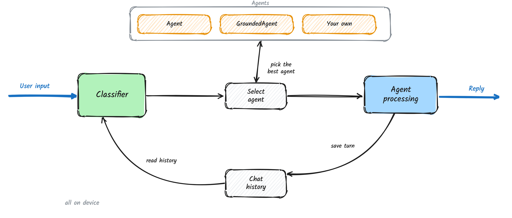
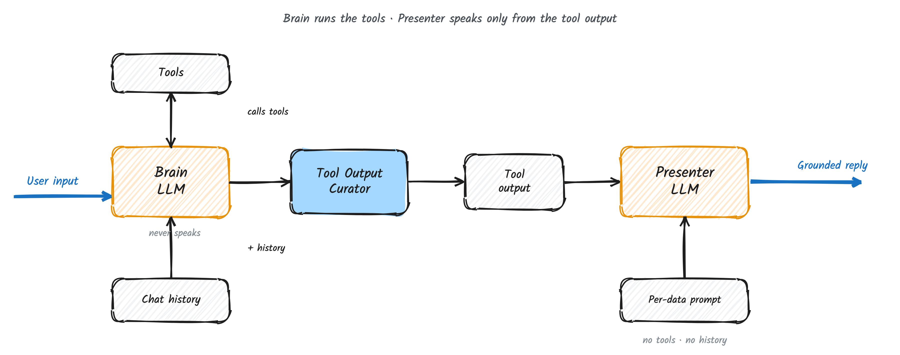
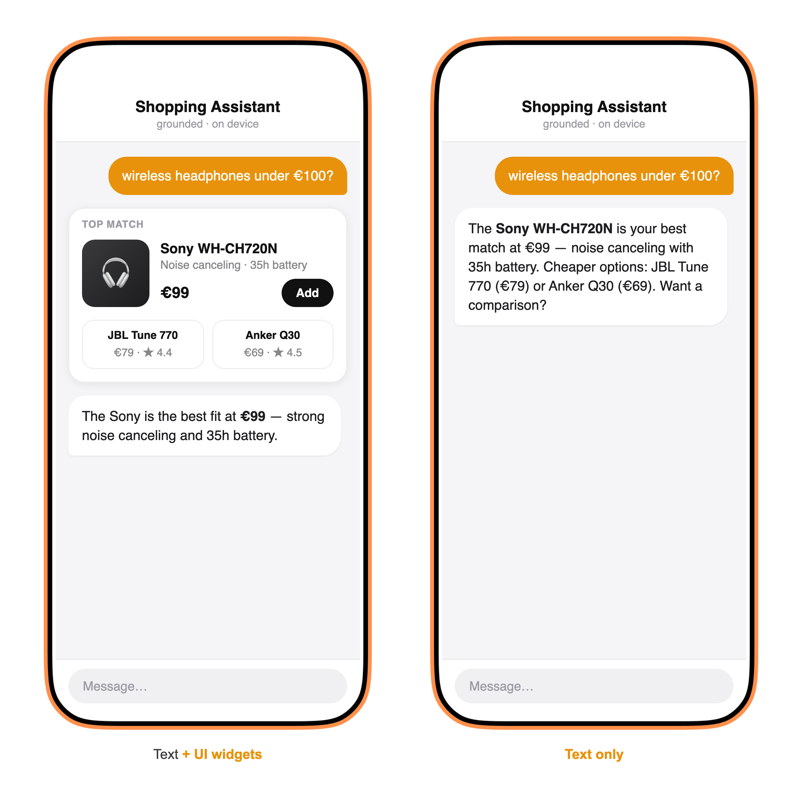

<h2 align="center">Agent Squad — Swift</h2>

<p align="center">A lightweight, protocol-driven multi-agent framework for Apple platforms — on-device agent orchestration, MCP tools, realtime voice, and first-class tracing.</p>

<p align="center">
  
  
  
</p>

> **Status: work in progress.** Built incrementally, one reviewed component at a time. The public
> API is not yet stable.
>
> **Versioning:** until the first stable release, install with `branch: "main"` (as in the quick
> start below). Swift releases will use bare semver tags (`0.1.0`, `0.2.0`, …) — the
> `typescript_*`/`python_*` tags in this monorepo are not SwiftPM-resolvable.

## Requirements

- **iOS 16+** / **macOS 14+**
- **Swift 6.2** toolchain (Xcode 26+), Swift 6 language mode

The whole framework runs on **iOS 16+**, including the bundled `FileChatStorage` (JSON-file
persistence). The one piece gated higher is `DeviceChatStorage` (SwiftData), which needs **iOS 17+ /
macOS 14+**. iOS 15 is not supported: the MCP Swift SDK and core `Duration`/`ContinuousClock`/
`URL.appending(path:)` all require iOS 16.

## What this is

A multi-agent framework built to **run on device**: small protocols you extend, swappable agents,
classifier routing, and pluggable chat storage — plus what an on-device assistant needs:

- 🧠 **Swappable agents** — pick a simple single-LLM agent, or a grounded *Brain → Presenter* agent
  that answers only from what the tools actually returned.
- 🔌 **Remote or on-device models** — use any remote, OpenAI-compatible LLM today; run models fully
  on device *(soon)*.
- 🧰 **Tools from any source** — Model Context Protocol (MCP) servers, native Swift functions, or a
  mix; the agent doesn't care where a tool comes from.
- 🪟 **Text or rich UI** — answers come back as plain text or as text plus interactive widgets, your
  choice per agent.
- 🎙️ **Realtime voice** — natural spoken conversations with interrupt-to-speak, as a first-class part
  of the framework.
- 📈 **Built-in tracing** — see every step of a run, locally during development or shipped to your
  observability tool of choice.
- 💾 **Local-first chat history** — conversations persist on device, with storage you can swap out.

## How it works

<p align="center">
  
</p>

1. **Classify** — user input arrives and the Classifier reads it (with the chat history) to route the turn.
2. **Select** — it picks the best agent for the job: a plain `Agent`, a `GroundedAgent`, or one of your own.
3. **Process** — the chosen agent runs the turn (calling tools as needed) and produces the reply.
4. **Store & respond** — the turn is saved to the chat history and the answer goes back to the user.

Single-agent apps skip the classifier entirely — the orchestrator just runs your one agent.

## Introducing GroundedAgent: Grounded Answers

`GroundedAgent` is the framework's anti-hallucination pattern: **two LLMs**, not one.

<p align="center">
  
</p>

- **Brain** — one system prompt (shared across all tools) with full instructions, the chat history, and the tools. It
  decides what to fetch, calls the tools, and produces the **tool output** — but never speaks to the
  user.
- **Presenter** — no tools, no chat history, no tool responses, no generic instructions. Just the
  **tool output** plus a small prompt chosen for the specific data being shown. With nothing to call
  and only the output in front of it, it can't invent values beyond what was actually fetched.

A no-tool turn answers in one pass — the Brain replies directly, no Presenter. The same
Brain → tool output → Presenter core also powers the realtime voice runtime.

By default the Presenter also sees this turn's **question** (tagged separately from the data) so it
can answer directly; pass `presenterInput: .dataOnly` for strict data-only presenting. It never
sees the chat history or the Brain's transcript in either mode.

### The prompts

The **Brain** runs one system prompt for all tools — role, the full tool catalog, and the rules for
gathering and resolving follow-ups:

```text
You are the data brain of a shopping assistant.
GATHER the facts needed to answer the user — never write the final reply.

Tools:
  search_products(query, max_price)  → matching products
  get_product(id)                    → details · price · rating · stock
  get_order(id)                      → order + delivery status

Rules:
- Call whatever tools you need; you may chain several.
- Use the chat history to resolve follow-ups ("cheaper ones?", "is it in stock?").
- Never invent values. If a tool returns nothing, note that.
- Do NOT address the user or format anything — the presenter does that.
```

In a real assistant this is *the big one* — easily several hundred to a couple thousand tokens once
the full tool catalog, domain rules, and output policy are in.

The **Presenter** instead picks **one small prompt for the data being shown** (a few dozen tokens
each) — here, the one for product results:

```text
You are presenting product search results.
Use ONLY the data block provided — never invent a price, rating, name, or stock status.
Lead with the best match: its name and price, then one standout detail.
Two short sentences, natural tone. Do not call tools.
```

### Tool UIs → widgets

The same answer can come back as **plain text**, or as **text plus UI elements** (cards, lists, and
the like) — you choose per agent. When a tool has a UI to show, the framework can surface it as a
**widget** next to the reply, or fold everything into a text-only answer.

<p align="center">
  
</p>

→ How a tool UI flows through the agent: **[the Tool UIs docs](../docs/src/content/docs/swift/ui/overview.md)**.

## Quick start

A complete first run — a tiny command-line executable you can `swift run`.

**1. Create the package** — `Package.swift`:

```swift
// swift-tools-version: 6.0
import PackageDescription

let package = Package(
    name: "quickstart",
    platforms: [.macOS(.v14)],
    dependencies: [
        .package(url: "https://github.com/2FastLabs/agent-squad", branch: "main")
    ],
    targets: [
        .executableTarget(name: "quickstart", dependencies: [
            .product(name: "AgentSquad", package: "agent-squad")
        ])
    ]
)
```

**2. Write it** — `Sources/quickstart/main.swift`. One agent, no classifier (the common case):

```swift
import AgentSquad
import Foundation

guard let apiKey = ProcessInfo.processInfo.environment["OPENAI_API_KEY"] else { fatalError("set OPENAI_API_KEY") }
let model = ChatCompletionsClient(model: "gpt-4o-mini", apiKey: apiKey)

let agent = Agent(name: "Shop", description: "Shopping assistant", model: model)

let orchestrator = Orchestrator(
    agents: [agent],
    store: try DeviceChatStorage(userId: "u1", inMemory: true)
    // classifier defaults to nil → no routing hop; the one agent always answers
)

for try await event in orchestrator.route(.text("wireless headphones under €100?"),
                                          userId: "u1", sessionId: "s1") {
    if case .textDelta(let token) = event { print(token, terminator: "") }
}
print()
```

**3. Run it:**

```bash
OPENAI_API_KEY=sk-… swift run
```

### Routing between agents

Give the orchestrator more than one agent and an `LLMClassifier`, and it routes each turn to the
best fit — the call site doesn't change:

```swift
let shop    = Agent(name: "Shop",    description: "Product search, prices, recommendations.", model: model)
let support = Agent(name: "Support", description: "Orders, returns, and account help.",        model: model)

let orchestrator = Orchestrator(
    agents: [shop, support],                  // the first agent (shop) is the default/fallback
    classifier: LLMClassifier(model: model),  // picks the agent for each turn
    store: try DeviceChatStorage(userId: "u1", inMemory: true)
)

for try await event in orchestrator.route(.text("where is my order #1234?"),
                                          userId: "u1", sessionId: "s1") {
    if case .textDelta(let token) = event { print(token, terminator: "") }
}
```

From here: give an agent a `ToolProvider` for tools — build native ones with `ToolKit` (`Tool.local`
for Swift code, `Tool.http`/`HTTPToolGroup` for APIs), connect an MCP server with `MCPServer(url:)`,
or mix them with `AggregateToolProvider` — or swap `Agent` for `GroundedAgent`. None of it changes
the call site.

## Modules — add only what you use

The package ships as **separate libraries** so the core stays dependency-free; you import only
the integrations you need (each isolates its own dependencies):

| Library | `import` | Pulls in | Contents |
|---|---|---|---|
| **`AgentSquad`** (core) | `import AgentSquad` | **nothing external** | protocols, agents, orchestrator, native tools (`ToolKit`, `Tool.local`/`.http`, `HTTPToolGroup`, `AggregateToolProvider`), `FileChatStorage`, `DeviceChatStorage` _(iOS 17+)_, `InMemoryChatStorage`, `OSLogTracer` |
| **`AgentSquadMCP`** | `import AgentSquadMCP` | the official [MCP Swift SDK](https://github.com/modelcontextprotocol/swift-sdk) | `MCPServer` (alias of `MCPToolProvider`) — connect any MCP server with `MCPServer(url:)`, with MCP Apps UI support |
| **`AgentSquadAudio`** | `import AgentSquadAudio` | AVFoundation (Apple platforms only) | `VoiceProcessedAudioIO` (echo-cancelled capture + playback on one engine — the recommended wiring), `MicCapture`, `AudioPlayback` for the realtime voice runtime — requires `NSMicrophoneUsageDescription` in your Info.plist |

So an app that doesn't use MCP never downloads the MCP SDK. Future optional integrations
(e.g. `AgentSquadLangfuse` for trace export) follow the same pattern — the core never grows a
dependency. Add a product to your target's `dependencies` to use it:

```swift
.target(name: "MyApp", dependencies: [
    .product(name: "AgentSquad", package: "agent-squad"),
    .product(name: "AgentSquadMCP", package: "agent-squad"),   // only if you want MCP tools
])
```

## Voice audio — echo cancellation and full control

The audio layer captures through Apple's **Voice-Processing I/O** unit by default — the native
equivalent of what ChatGPT's voice mode gets via WebRTC. The signal sent to the speaker is used
as a hardware reference to subtract the assistant's own voice from the mic, plus noise
suppression and automatic gain control. Without it, the assistant hears itself through the
speaker and interrupts its own answers.

The audio layer is configurable in four independent levels — each level keeps everything the
previous levels give you:

**Level 0 — defaults.** `VoiceProcessedAudioIO` runs capture **and** playback on one
`AVAudioEngine`, so the assistant's audio renders through the voice-processed output and is by
construction in the echo canceller's reference path. Pass one instance as both `input:` and
`output:`:

```swift
import AgentSquadAudio

let io = VoiceProcessedAudioIO()
let runtime = RealtimeRuntime(session: assistant, input: io, output: io)
try await runtime.start()
```

The separate `MicCapture` + `AudioPlayback` pair still works (both echo-cancelled on the capture
side by default) — but with two engines the echo reference is taken at the device level, which is
route-dependent. Prefer `VoiceProcessedAudioIO` for voice sessions.

**Level 1 — tune voice processing** (or turn it off):

```swift
// Keep AEC but disable gain control and minimize how much the system ducks playback volume:
let io = VoiceProcessedAudioIO(voiceProcessing: .init(automaticGainControl: false, duckingLevel: .min))

// Raw capture — no AEC at all (the previous default; split pair only):
let rawMic = MicCapture(voiceProcessing: nil)
```

If the Voice-Processing unit can't be enabled, `start()` throws
`MicCaptureError.voiceProcessingUnavailable(_:)` rather than silently degrading — catch it and
retry with `voiceProcessing: nil` if raw capture is an acceptable fallback for your app.

**Level 2 — own the `AVAudioSession`, or reach the raw engine.** All three audio classes take
an `AudioSessionPolicy` (if you use the split pair, give both the same one so they can't fight):

```swift
// Your app already manages its AVAudioSession (music, video, CallKit…) — AgentSquad won't touch it.
// You must configure AND activate the session yourself before runtime.start().
let io = VoiceProcessedAudioIO(sessionPolicy: .external)

// Or let AgentSquad drive the timing but with YOUR configuration (iOS):
let io2 = VoiceProcessedAudioIO(sessionPolicy: .custom { session in
    try session.setCategory(.playAndRecord, mode: .voiceChat, options: [.allowBluetoothHFP])   // no speaker override
    try session.setActive(true)
})
```

The `configureEngine` hook hands you the underlying `AVAudioEngine` at the right lifecycle
moment (after voice processing is enabled, before the tap is installed), so any AVFoundation
API stays reachable without forking the class:

```swift
let io = VoiceProcessedAudioIO(configureEngine: { engine in
    // e.g. inspect engine.inputNode, insert effect nodes, adopt future AVFoundation APIs…
})
```

**Level 3 — replace the audio path entirely.** `AudioInput`/`AudioOutput` are protocols and
`RealtimeRuntime` accepts any conformer — bring WebRTC capture, CallKit audio, or a fully custom
pipeline and keep the rest of the stack (transport, VAD, tools, tracing):

```swift
final class MyCapture: AudioInput { /* frames, start(), stop() */ }
let runtime = RealtimeRuntime(session: assistant, input: MyCapture(), output: AudioPlayback())
```

> **Validate on a real device.** The simulator performs no echo cancellation at all, so AEC can't
> be tested there. Expect voice-processed audio to sound "call-like" and slightly quieter — use
> `duckingLevel: .min` to compensate. Never enable voice processing on the playback engine; it
> belongs on capture only.

## Architecture

Two peer runtimes share one set of contracts but not a control loop: a turn-based `Orchestrator`
(classify? → dispatch → stream → persist) and a long-lived `RealtimeSession` for voice. Agents,
tools (`ToolProvider`), storage (`ChatStorage`), and tracing (`Tracer`) are all swappable protocols;
optional integrations (MCP, tracing exporters) ship as separate products so the core stays
dependency-free.

## Building with an AI assistant

This repo ships a **skill** — a single, assistant-agnostic guide at [`SKILL.md`](SKILL.md) with the
mental model, the real API signatures, task recipes, and the gotchas, for both the built-in types and
writing your own.

It isn't auto-installed — point your assistant at it. For example, tell it:

> *Read `SKILL.md` before writing any AgentSquad code.*

Works with any assistant (Claude, Cursor, Copilot, …). Claude Code users can also drop it in as a
skill: copy it to `.claude/skills/agent-squad-swift/SKILL.md`.

## License

Apache 2.0 — see the repository [`LICENSE`](../LICENSE).
